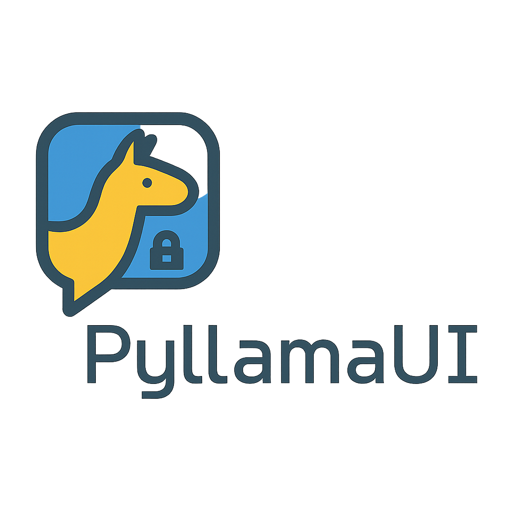

# PyLlamaUI 🐍��  
<p align="center">
  
</p>  

*A Python-based offline GUI for running AI models with Ollama*


---

## 🌟 About

**PyLlamaUI** is an open-source offline desktop application built with Python that lets you run and chat with large language models (LLMs) using [Ollama](https://ollama.com).

> 🧠 No cloud. No tracking. Just pure local AI — fast, secure, and private.

---

## 🚀 Features

* 🖥️ Simple, clean GUI for chatting with LLMs
* 🔌 Interacts with local Ollama server via REST API
* 🔄 Load and switch between models (e.g., LLaMA 3, Mistral)
* 📀 Save prompt history locally
* ⚙️ Customizable settings: max tokens, temperature, system prompt
* 🌗 Light/dark mode support *(optional)*

---

## 🛠️ Tech Stack

* **Python 3.10+**
* [`customtkinter`](https://github.com/TomSchimansky/CustomTkinter) for GUI
* `requests` for API communication
* [Ollama](https://ollama.com) (installed and running locally)

---

## 📦 Windows `.exe` Version

We offer a pre-built `.exe` file for Windows users:

👉 **[Download latest `.exe`](https://github.com/YOUR_USERNAME/YOUR_REPO/releases/latest)** from the Releases section.

> ⚠️ Make sure [Ollama](https://ollama.com/download) is installed and running on your system before launching the app.

---

## 🐧 Linux & macOS

Use the Python source directly or a `.deb` (coming soon):

```bash
git clone https://github.com/YOUR_USERNAME/pyllamaui.git
cd pyllamaui
pip install -r requirements.txt
python main.py
```

---

## 📸 Screenshots

> Coming soon...

---

## 📝 License

This project is licensed under the MIT License.

---

## 🤝 Contributing

Feel free to fork, raise issues, or send PRs! Contributions are always welcome.
